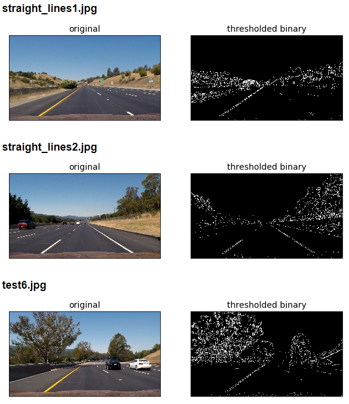

Project 4, Term 1: Advance Lane Finding
=================================================

Final Result
--------------

Writeup / README
--------------

#### Provide a Writeup / README that includes all the rubric points and how you addressed each one. You can submit your writeup as markdown or pdf.

This document is the README file

Camera Calibration
---------------------

#### Briefly state how you computed the camera matrix and distortion coefficients. Provide an example of a distortion corrected calibration image.

The calibrated images shown below on the right were created from the images on the left by using the following Open CV functions:

1. imread to read images
2. findChessboardCorners to find corners
3. calibrateCamera to remove distortion

Pipeline (test images)
---------------------

#### Provide an example of a distortion-corrected image.

The distortion corrected images shown below on the right were created from the images on the left using Open CV's undistort function with parameters created during Camera Calibration

#### Describe how (and identify where in your code) you used color transforms, gradients or other methods to create a thresholded binary image. Provide an example of a binary image result.

The thresholded binary image is a black and white copy of the original with
sobel x, hls s channel, magnitude and directional thresholds combined.

 The following thresholded binary images were created in Step 3 of the Jupyter Notebook contained in this repository:

#### Describe how (and identify where in your code) you performed a perspective transform and provide an example of a transformed image.

Bird's Eye views were created by applying a trapezoid mask to the original image and then warping it onto a rectangular, Bird's Eye view image using Open CV's warpPerspective function.

The following perspective transformations were created in Step 4 of the Jupyter Notebook contained in this repository:

#### Describe how (and identify where in your code) you identified lane-line pixels and fit their positions with a polynomial?

Matlotlib's histogram function was applied to the bird's eye mask above to identify the vertical slices with the highest number of pixels.  Lane lines were identified by selecting the vertical slices:

1. With high pixel counts
2. Located closest to the rectangle edges in the bird's eye mask 

The following lane line pixels were identified in Step 5 of the Jupyter Notebook contained in this repository:

#### Describe how (and identify where in your code) you calculated the radius of curvature of the lane and the position of the vehicle with respect to center.

The images on the left below are estimated on the first video image.  A set two rectangles is created at the left and right lane line peaks.  Subsequent windows are stacked on the windows and adjusted based on the mean density of pixels in each rectangle.  The images on the right use the curve generated from the left image to create an adjusted curve based on the shifts in pixel densities.

The following lane curvatures were calculated in Step 6 of the Jupyter Notebook contained in this repository:

#### Provide an example image of your result plotted back down onto the road such that the lane area is identified clearly.

The following processed images were warped back and applied to their respective original images:

Pipeline (video)
--------------
#### Provide a link to your final video output. Your pipeline should perform reasonably well on the entire project video.

The project and challenge videos are included in Step 8 of the Jupyter Notebook contained in this repository.  Animated gif's of the videos are shown below:

Discussion
--------------
#### Briefly discuss any problems / issues you faced in your implementation of this project. Where will your pipeline likely fail? What could you do to make it more robust?

The major difficulty with this project is that the best mask size for the project video creates a mask size that is too large for the challenge video.  To overcome this issue, a function was created to dynamically generate bird's eye masks for each video based on lane line identification.

Another issue is the generation of curve radii.  The rectangle sizes and polynomial boundaries needed to generate lane boundaries for highways are narrower than those needed to generate boudaries on winding, mountain roads.  To overcome this issue, a dynamic boundary sizing algorithm would need to be created based on the speed limit of the road. 